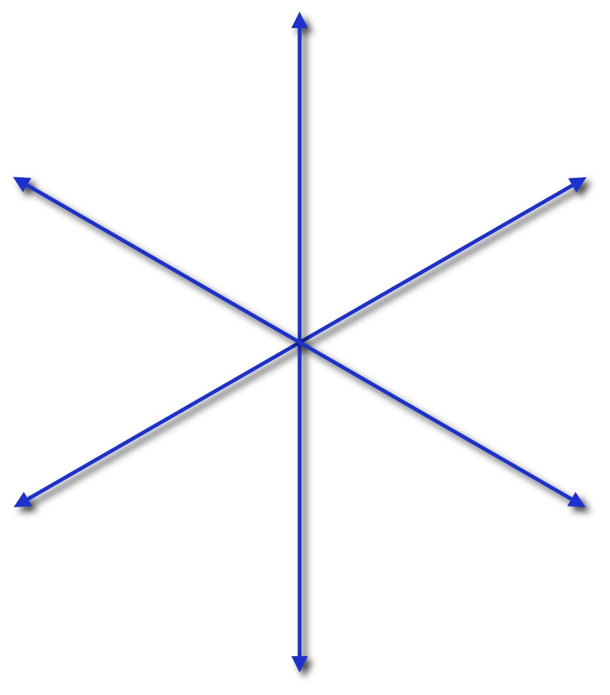

# RiemannHilbert.jl
A Julia package for solving Riemann–Hilbert problems

[](https://github.com/JuliaHolomorphic/RiemannHilbert.jl/actions/workflows/ci.yml)
[](https://codecov.io/gh/JuliaHolomorphic/RiemannHilbert.jl)
[](https://gitter.im/JuliaApproximation/ApproxFun.jl?utm_source=badge&utm_medium=badge&utm_campaign=pr-badge&utm_content=badge)


<center>
  
</center>


A Riemann–Hilbert problem is a certain type of boundary value problem in the complex plane where an analytic function has prescribed jumps. 
They arise in integrable systems, random matrices, spectral analysis, orthogonal polynomials, and elsewhere. This package implements
the numerical method of [Olver 2011, Olver 2012] (see also review in [Trogdon & Olver 2015]) for solving Riemann–Hilbert problems, and is very much related to [RHPackage](https://github.com/dlfivefifty/RHPackage). 

For an example, the following calculates the Hastings–McLeod solution to Painlevé II at the origin,
which is posed on 4 rays:
```julia
using RiemannHilbert, ContinuumArrays

s₁, s₃ = im, -im   # Stokes multipliers of the Hastings–McLeod solution
Θ(z) = 8/3*z^3

# The jump matrices on the four rays, each oriented outwards from the origin
G = [[1 0; s₁*exp(im*Θ(z)) 1] for z in Segment(0, 2.5exp(im*π/6))] ⊎
    [[1 0; s₃*exp(im*Θ(z)) 1] for z in Segment(0, 2.5exp(5im*π/6))] ⊎
    [[1 -s₁*exp(-im*Θ(z)); 0 1] for z in Segment(0, 2.5exp(-5im*π/6))] ⊎
    [[1 -s₃*exp(-im*Θ(z)); 0 1] for z in Segment(0, 2.5exp(-im*π/6))]

# Solve Φ₊ = Φ₋G with Φ(z) → I as z → ∞, using 200 collocation points on each ray
Φ = rhsolve(G, 200)
z = exp(im*π/6)
Φ(z * ⁺) ≈ Φ(z * ⁻) * G[z] # true: ⁺ and ⁻ give the limits from the left and right of the ray

# Φ = I + 𝒞U where U is the density on the contour, so that
# 2 lim_{z → ∞} z Φ(z)₁₂ = -2 ∫ U₁₂ /(2πi)
U = RiemannHilbert.rh_sie_solve(G, 200)
2*sum(U[1,2])/(-2π*im) # -0.3670615515480784
```
By default `rhsolve` solves `Φ₊ = Φ₋G`: use `rhsolve(G, n; side=:left)` for `Φ₊ = GΦ₋`.

A `Segment` can be plotted with [Makie](https://docs.makie.org) or [Plots](https://docs.juliaplots.org), with an arrow at its midpoint showing its orientation. For example, after `using DomainSets` the contour above is plotted by `foreach(Γ -> plot!(Γ), components(domain(G)))`. See [examples/painleveII.jl](examples/painleveII.jl) for phase portraits of the solution to a Riemann–Hilbert problem.

# References

1. T. Trogdon & S. Olver (2015), [Riemann–Hilbert Problems, Their Numerical Solution and the Computation of Nonlinear Special Functions](http://bookstore.siam.org/ot146/), SIAM.
2. S. Olver (2012), [A general framework for solving Riemann–Hilbert problems numerically](https://link.springer.com/article/10.1007/s00211-012-0459-7), Numer. Math., 122: 305–340.
3. S. Olver (2011), [Numerical solution of Riemann–Hilbert problems: Painlevé II](https://link.springer.com/article/10.1007/s10208-010-9079-8), Found. Comput. Maths, 11: 153–179.
